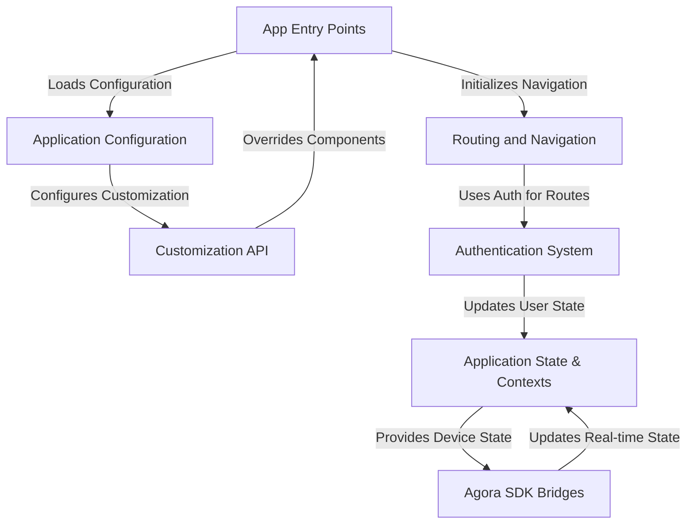

# JOINX Repository: Installation and Configuration Guide

## Installation Steps

### 1. Clone the Repository

```bash
git clone https://github.com/Asil786/JOINX.git
cd JOINX
```

### 2. Install Dependencies

- **Node.js (Main Project & Electron/React Native Parts):**
    ```bash
    npm install
    ```
- **iOS (React Native Only):**
    ```bash
    cd ios
    pod install
    cd ..
    ```
- **Android:**  
  Use the standard React Native Android workflow.

### 3. Build Instructions

- **Electron App:**
    - The project uses `electron-builder.js` and `Gulpfile.js` for build automation.
    - To build for Electron (desktop):
      ```bash
      npm run build:electron
      # Or use Gulp tasks as defined in Gulpfile.js
      ```

- **Android:**
    ```bash
    npm run android
    # Or use Gulp tasks for gradle:
    gulp gradleBuildUnix   # on Mac/Linux
    gulp gradleBuildWin    # on Windows
    ```

- **iOS:**
    ```bash
    npm run ios
    # Or open ios/JOINX.xcworkspace in Xcode and build
    ```

---

## Configuration

### Main Configuration File

- **`defaultConfig.js`**  
  Most runtime settings and options are set here, including:
  - Endpoints
  - Feature toggles
  - OAuth settings
  - UI preferences

### Custom Configuration

- **Edit `defaultConfig.js` and/or `customization.config.js`** to:
  - Provide endpoints
  - Toggle features (`CHAT`, `CLOUD_RECORDING`, `ENCRYPTION_ENABLED`, etc.)
  - Set branding (logo, colors)

### Environment Variables

- Set `TARGET` for some build targets (e.g., `wsdk`, `rsdk`, `android`).

### Electron Builder

- Configured in `electron-builder.js` for multi-platform builds (AppImage for Linux, DMG/ZIP for macOS, NSIS for Windows).

### iOS CocoaPods

- The `Podfile` specifies dependencies such as `AgoraRtcEngine_iOS`.

### Android

- Standard React Native Android setup with Gradle.

---

## Example Configuration (`defaultConfig.js`)

```js
module.exports = {
  ICON: 'logoSquare.png',
  FRONTEND_ENDPOINT: '',
  BACKEND_ENDPOINT: 'https://managedservices-preprod.rteappbuilder.com',
  PSTN: false,
  PRECALL: true,
  CHAT: true,
  CLOUD_RECORDING: false,
  RECORDING_MODE: 'WEB',
  SCREEN_SHARING: true,
  ENCRYPTION_ENABLED: false,
  ENABLE_GOOGLE_OAUTH: false,
  GOOGLE_CLIENT_ID: '',
  // ... more options
};
```

**Tip:**  
Adjust these settings as per your backend and frontend endpoint, and enable/disable features you need.

---

## Summary

- Clone and install dependencies (`npm install`, `pod install` for iOS)
- Use Gulp/npm scripts to build for your platform (Electron, Android, iOS)
- Edit `defaultConfig.js` for your feature and API endpoint customizations

---

# Tutorial: JOINX

JOINX is a multi-platform real-time engagement application (like video conferencing) that can be run as a standalone app or embedded as an SDK. It provides core features for video/audio calls and chat, built on top of Agora SDKs, and includes a *powerful customization API* allowing developers to build **branded versions** by injecting custom UI components, logic, and configurations across different **entry points** for web, native, and desktop platforms.


## Visual Overview



## Chapters

1. [App Entry Points
](01_app_entry_points_.md)
2. [Application Configuration
](02_application_configuration_.md)
3. [Application State & Contexts
](03_application_state___contexts_.md)
4. [Authentication System
](04_authentication_system_.md)
5. [Routing and Navigation
](05_routing_and_navigation_.md)
6. [Agora SDK Bridges
](06_agora_sdk_bridges_.md)
7. [Customization API
](07_customization_api_.md)

---
