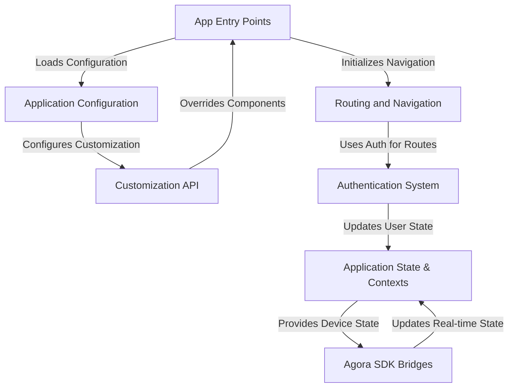
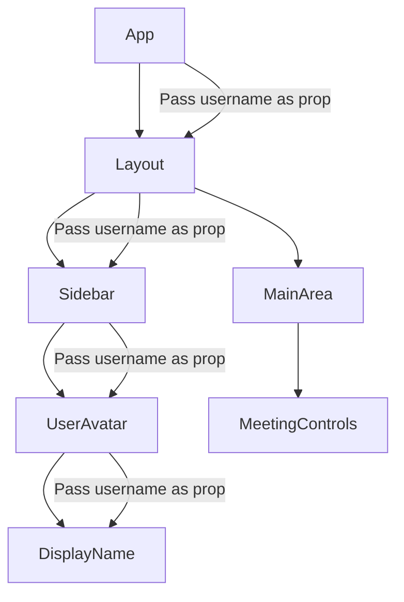
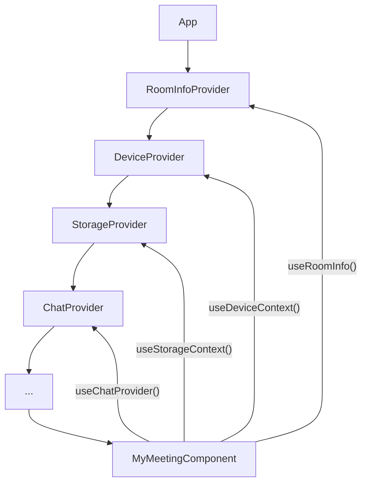
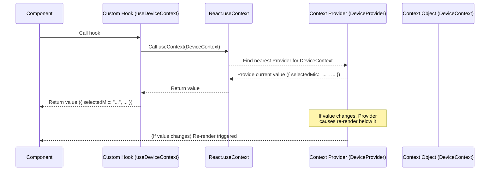

# JOINX Repository: Installation and Configuration Guide

## Installation Steps

### 1. Clone the Repository

```bash
git clone https://github.com/Asil786/JOINX.git
cd JOINX
```

### 2. Install Dependencies

- **Node.js (Main Project & Electron/React Native Parts):**
    ```bash
    npm install
    ```
- **iOS (React Native Only):**
    ```bash
    cd ios
    pod install
    cd ..
    ```
- **Android:**  
  Use the standard React Native Android workflow.

### 3. Build Instructions

- **Electron App:**
    - The project uses `electron-builder.js` and `Gulpfile.js` for build automation.
    - To build for Electron (desktop):
      ```bash
      npm run build:electron
      # Or use Gulp tasks as defined in Gulpfile.js
      ```

- **Android:**
    ```bash
    npm run android
    # Or use Gulp tasks for gradle:
    gulp gradleBuildUnix   # on Mac/Linux
    gulp gradleBuildWin    # on Windows
    ```

- **iOS:**
    ```bash
    npm run ios
    # Or open ios/JOINX.xcworkspace in Xcode and build
    ```

---

## Configuration

### Main Configuration File

- **`defaultConfig.js`**  
  Most runtime settings and options are set here, including:
  - Endpoints
  - Feature toggles
  - OAuth settings
  - UI preferences

### Custom Configuration

- **Edit `defaultConfig.js` and/or `customization.config.js`** to:
  - Provide endpoints
  - Toggle features (`CHAT`, `CLOUD_RECORDING`, `ENCRYPTION_ENABLED`, etc.)
  - Set branding (logo, colors)

### Environment Variables

- Set `TARGET` for some build targets (e.g., `wsdk`, `rsdk`, `android`).

### Electron Builder

- Configured in `electron-builder.js` for multi-platform builds (AppImage for Linux, DMG/ZIP for macOS, NSIS for Windows).

### iOS CocoaPods

- The `Podfile` specifies dependencies such as `AgoraRtcEngine_iOS`.

### Android

- Standard React Native Android setup with Gradle.

---

## Example Configuration (`defaultConfig.js`)

```js
module.exports = {
  ICON: 'logoSquare.png',
  FRONTEND_ENDPOINT: '',
  BACKEND_ENDPOINT: 'https://managedservices-preprod.rteappbuilder.com',
  PSTN: false,
  PRECALL: true,
  CHAT: true,
  CLOUD_RECORDING: false,
  RECORDING_MODE: 'WEB',
  SCREEN_SHARING: true,
  ENCRYPTION_ENABLED: false,
  ENABLE_GOOGLE_OAUTH: false,
  GOOGLE_CLIENT_ID: '',
  // ... more options
};
```

**Tip:**  
Adjust these settings as per your backend and frontend endpoint, and enable/disable features you need.

---

## Summary

- Clone and install dependencies (`npm install`, `pod install` for iOS)
- Use Gulp/npm scripts to build for your platform (Electron, Android, iOS)
- Edit `defaultConfig.js` for your feature and API endpoint customizations

---

# Overview: JOINX

JOINX is a multi-platform real-time engagement application (like video conferencing) that can be run as a standalone app or embedded as an SDK. It provides core features for video/audio calls and chat, built on top of Agora SDKs, and includes a *powerful customization API* allowing developers to build **branded versions** by injecting custom UI components, logic, and configurations across different **entry points** for web, native, and desktop platforms.


## Visual Overview



# Application State & Contexts

what about data that changes *while* the application is running? Information like:
*   Who is the currently logged-in user?
*   Which microphone or camera is currently selected?
*   What is the title of the meeting room?
*   Have any new chat messages arrived?
*   Is the screen share currently active?

This dynamic data needs to be accessible by many different parts of the application, and components often need to react when this data changes. This is where **Application State & Contexts** come in.

## The Problem: Passing Data Down (Prop Drilling)

Imagine you have data (like the user's name) at the very top of your application's component tree. If a component several levels down needs that user's name, you have to pass it as a "prop" (property) from the top component, to its child, to its grandchild, and so on, until it reaches the component that actually needs it.



This is called **"prop drilling,"** and it quickly becomes cumbersome. If a component deep in the tree needs data from the top, and lots of components in between don't actually use that data but just pass it along, your code becomes hard to manage and understand.

## The Solution: React Context

React provides a feature called **Context** specifically to solve this problem. Context allows you to create a way to share data like this **"without having to pass props manually through every level of the tree."**

Think of it like placing a **"global blackboard"** or a **"shared bulletin board"** at a specific point in your component tree. Any component *below* that point can tap into the blackboard and read the information posted there. Some components might also be allowed to write or update information on the blackboard.

In JOINX, we use React Context extensively to manage the application's state. Instead of drilling props for user info, device selections, room details, chat messages, etc., this information is placed onto various "blackboards" (Contexts) near the top of the application.

## Accessing State with Custom Hooks

While you can directly use `Context.Consumer` components, a more common and cleaner pattern in modern React (and heavily used in JOINX) is to use **custom hooks**.

JOINX provides a set of custom hooks, like `useRtc`, `useRoomInfo`, `useDeviceContext`, `useChatUIControls`, etc. These hooks are the primary way components *read* information from the different Contexts.

Using hooks makes your components cleaner because you just import the specific hook you need and call it to get the data, without worrying about the `Consumer` component syntax.

It's like the custom hooks are your **"special tools"** that let you easily read the information posted on the blackboard whenever you need it.

## Key Contexts and Hooks in JOINX

JOINX manages various types of application state using different Contexts. Here are some important ones and their corresponding custom hooks:

| State/Data Type        | Context Name          | Primary Hook          | What it manages                                                                 |
| :--------------------- | :-------------------- | :-------------------- | :------------------------------------------------------------------------------ |
| Core RTC Engine        | `RtcContext`          | `useRtc`              | State and methods for the Agora RTC video/audio engine.                       |
| User Content (Streams) | `ContentContext`      | `useContent`          | Information about users' video, audio, screen share streams (muted, active, etc.). |
| Device Management      | `DeviceContext`       | `useDeviceContext`    | List of devices (mic, cam, speaker), currently selected devices, changing devices. |
| Meeting/Room Info      | `RoomInfoContext`     | `useRoomInfo`         | Meeting title, room ID, user's role (host/attendee), tokens, feature flags for the room. |
| Room Info Setter       | `SetRoomInfoContext`  | `useSetRoomInfo`      | Allows updating the RoomInfoContext data.                                     |
| Chat/RTM Engine        | `RtmContext` (`ChatContext.ts`) | `useRtm` (and `useMessages`) | State and methods for the Agora RTM messaging engine, chat messages.          |
| Persistent Storage     | `StorageContext`      | `useStorageContext`   | User preferences stored locally (display name, remembered devices).           |
| Global Errors          | `ErrorContext`        | `useErrorContext`     | Manages application-wide errors and displaying toasts.                          |
| UI Controls (Chat)     | `ChatUIControlsContext` | `useChatUIControls` | State and methods for controlling the chat UI sidebar visibility.               |

This table isn't exhaustive, but it covers many core parts of the application state managed via Context. Notice how each hook is typically named after the data it provides (`useRoomInfo`, `useDeviceContext`).

## How to Use Them: Solving the Use Case

Let's go back to our use case: needing to easily access the meeting title and the user's selected microphone from anywhere in the application, without prop drilling.

Thanks to Context and hooks, this is straightforward.

First, you import the necessary hooks into your component file:

```typescript
// Inside MyMeetingComponent.tsx or any other component file
import React from 'react';
import { useRoomInfo, useDeviceContext } from 'customization-api';
// other imports ...

function MyMeetingComponent() {
  // Use the hooks to get the data you need
  const { data: { meetingTitle } } = useRoomInfo();
  const { selectedMic } = useDeviceContext();

  // Now you can use meetingTitle and selectedMic directly
  console.log("Current meeting title:", meetingTitle);
  console.log("Selected microphone:", selectedMic);

  return (
    <View>
      <Text>Meeting: {meetingTitle}</Text>
      <Text>Using mic: {selectedMic}</Text>
      {/* Rest of your component UI */}
    </View>
  );
}

// ... rest of the component
```

Explanation:
1.  We import `useRoomInfo` and `useDeviceContext` from `customization-api`. This file acts as a central place to export all the important hooks for easy access.
2.  Inside the `MyMeetingComponent` function component, we call the hooks:
    *   `useRoomInfo()` gives us access to the meeting's `RoomInfoContext` data. We use **destructuring** `{ data: { meetingTitle } }` to grab the specific piece of data we need (`meetingTitle`) which is nested inside the `data` object provided by the hook.
    *   `useDeviceContext()` gives us access to the `DeviceContext` data. We use destructuring `{ selectedMic }` to get the `selectedMic` string.
3.  Now, `meetingTitle` and `selectedMic` are just regular variables available for use anywhere within the `MyMeetingComponent`.

If the selected microphone changes (e.g., the user picks a different one in settings), the `useDeviceContext` hook will automatically trigger your component to re-render with the new `selectedMic` value. This reactivity is a key benefit of using Context and hooks.

You can use these hooks in *any* component within the part of the component tree that is wrapped by the corresponding Context Provider.

## Under the Hood: How it Works

Let's peek behind the curtain to see how this system is set up.

### 1. Defining a Context

Each piece of shared state starts with defining a Context using `React.createContext`. This function returns a Context object with a `Provider` and a `Consumer`.

Here's a simplified example based on `src/components/DeviceContext.tsx`:

```typescript
// Simplified DeviceContext.tsx
import { createContext } from 'react';

// Define the shape (interface) of the data this context will hold
interface DeviceContextInterface {
  selectedCam: string;
  setSelectedCam: (cam: string) => Promise<any>;
  selectedMic: string;
  // ... other device state
}

// Create the context with a default value
const DeviceContext = createContext<DeviceContextInterface>({
  selectedCam: '',
  selectedMic: '',
  setSelectedCam: async () => {},
  // ... default values for others
});

export default DeviceContext; // Export the context
```

This code simply defines the "shape" of the data (`DeviceContextInterface`) and creates the Context object (`DeviceContext`).

### 2. Providing the Context

For components to *read* data from a Context, there must be a **Provider** higher up in the component tree that *provides* the data. Providers are components that wrap other components and pass the current context value down.

In JOINX, many Context Providers are placed high up, often in or around the main `App.tsx` component, to make the state available to the majority of the application.



A simplified look at how a Provider might be used:

```typescript
// Conceptual App rendering structure
import {RoomInfoProvider} from './components/room-info/useRoomInfo';
import {DeviceProvider} from './components/DeviceContext'; // Conceptual Provider component
// ... other imports

function App() {
  // State managed locally within the Provider component
  const [roomInfo, setRoomInfo] = useState({...});
  const [devices, setDevices] = useState({...});

  return (
    <RoomInfoProvider value={{ data: roomInfo, /* ... */ }}>
      <DeviceProvider value={{ selectedCam: devices.cam, selectedMic: devices.mic, /* ... */ }}>
        {/* ... other providers ... */}
        <MyMeetingComponent /> {/* This component can now use useRoomInfo and useDeviceContext */}
        {/* ... rest of the app ... */}
      </DeviceProvider>
    </RoomInfoProvider>
  );
}
```

The actual Provider components (like `RoomInfoProvider` in `src/components/room-info/useRoomInfo.tsx` and `StorageProvider` in `src/components/StorageContext.tsx`) often manage the state themselves using `useState` or `useReducer` hooks and provide both the state value and a way to update it via the `value` prop of the `Context.Provider`.

For example, `StorageProvider` hydrates state from `AsyncStorage`, manages the `store` state using `useState`, and provides `store` and `setStore` via the context value:

```typescript
// Simplified src/components/StorageContext.tsx
import React, { createContext, useState, useEffect } from 'react';
// ... other imports

export interface StoreInterface { /* ... */ }
export interface StorageContextInterface {
  store: StoreInterface;
  setStore: React.Dispatch<React.SetStateAction<StoreInterface>> | null;
}

const StorageContext = createContext<StorageContextInterface>(/* default value */);

export const StorageProvider = (props: { children: React.ReactNode }) => {
  const [store, setStore] = useState<StoreInterface>(/* initial value */);

  useEffect(() => {
    // Load store from AsyncStorage on mount
    // ... setStore(...)
  }, []);

  useEffect(() => {
    // Save store to AsyncStorage when it changes
    // ...
  }, [store]); // Dependency array includes 'store'

  return (
    // Provide both the state value and the state setter
    <StorageContext.Provider value={{ store, setStore }}>
      {/* Render child components */}
      {props.children}
    </StorageContext.Provider>
  );
};

export default StorageContext; // Export the context itself
```

### 3. Creating the Custom Hook

Finally, the custom hooks like `useDeviceContext` and `useRoomInfo` are created. JOINX uses a utility function called `createHook` from `customization-implementation/createHook.ts` to simplify this process.

```typescript
// Simplified customization-implementation/createHook.ts
import React, { useContext } from 'react';

function createHook<T>(context: React.Context<T>) {
  // This function returns the actual hook
  function useContextWithSelector(): T {
    // This is the core: just use React.useContext
    const data = useContext(context);
    return data; // Return the context data
  }
  return useContextWithSelector; // Return the custom hook function
}

export default createHook;
```

And how it's used to create the specific hooks (from `customization-api/app-state.ts`):

```typescript
// Simplified customization-api/app-state.ts
import { createHook } from 'customization-implementation';
import DeviceContext from '../src/components/DeviceContext';
import RoomInfoContext from '../src/components/room-info/useRoomInfo';
// ... other imports

// Create the specific hooks using the utility
export const useDeviceContext = createHook(DeviceContext);
export const useRoomInfo = createHook(RoomInfoContext);
// ... other hooks
```

So, when you call `useDeviceContext()` in your component, you are effectively calling `useContext(DeviceContext)` under the hood, which reads the current value provided by the nearest `DeviceContext.Provider` above your component in the tree.

Here's the flow with the hook:



This system allows any component to easily "plug into" the shared state provided by the Contexts, making the application's data flow much more manageable compared to prop drilling.

## Conclusion

Application State and Contexts are crucial for managing dynamic data in the JOINX project. By using React Context, key information like user details, device selections, and room data is made available throughout the component tree without relying on manual prop passing.

The project provides a set of custom hooks (`useRtc`, `useRoomInfo`, `useDeviceContext`, etc.) as the standard way to access this shared state. These hooks are simple wrappers around `React.useContext`, making it clean and easy for any component to retrieve the information it needs and automatically react to changes.

Understanding Contexts and hooks is fundamental to working with the JOINX codebase, as they are used extensively to share data between different parts of the application.

Now that we understand how application state is managed, let's look at a specific system that heavily relies on this state: the application's authentication system.

---
